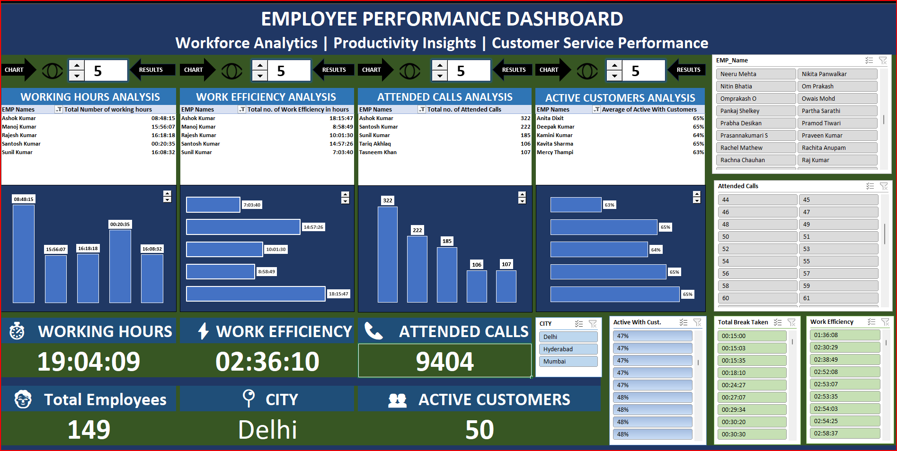
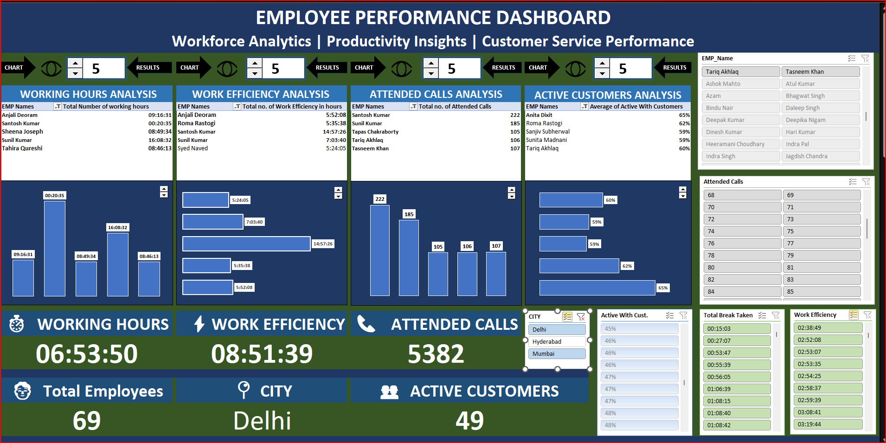
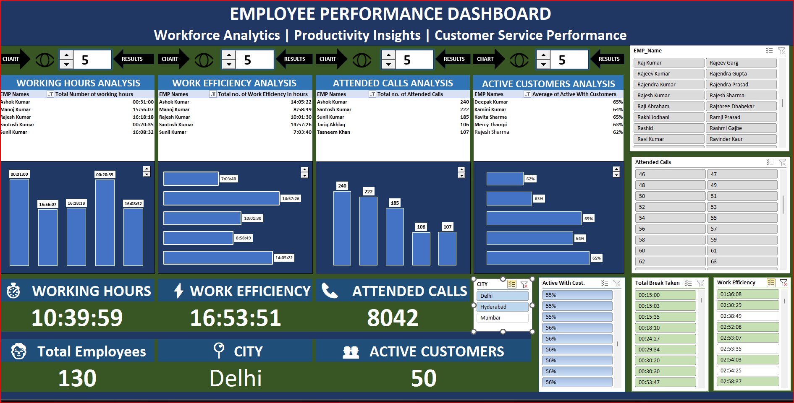
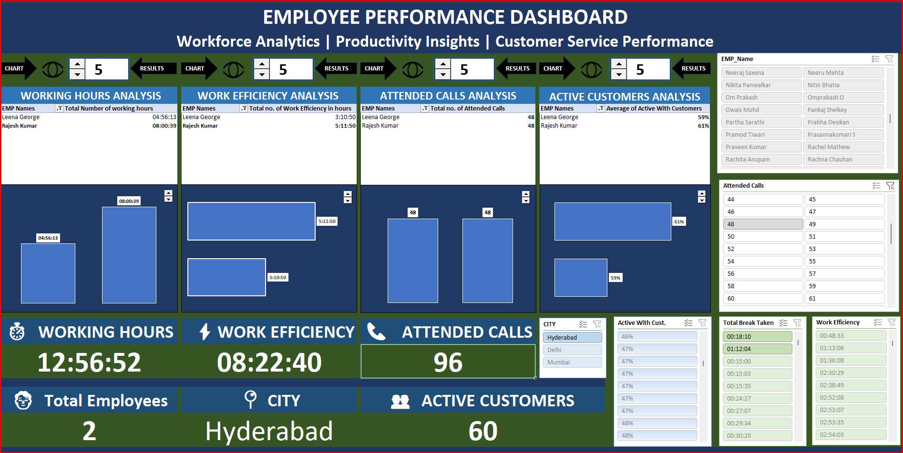
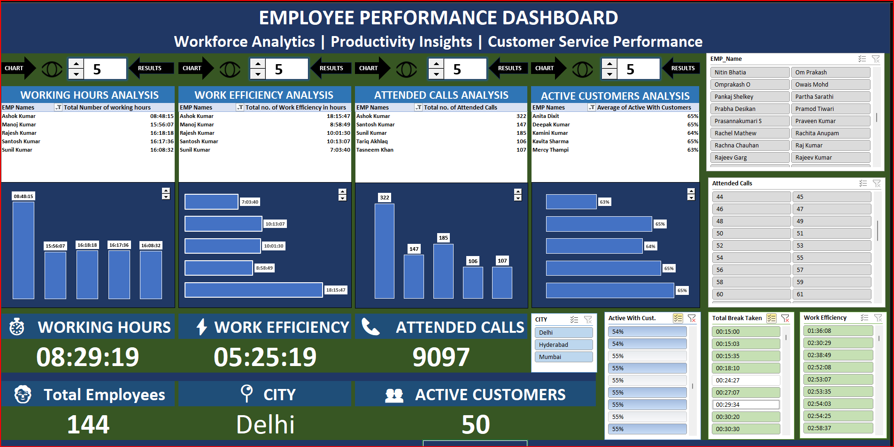
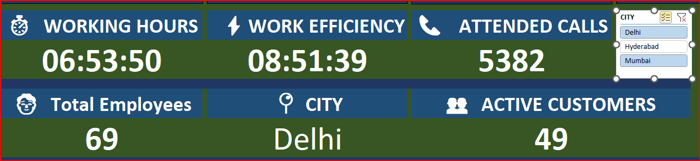
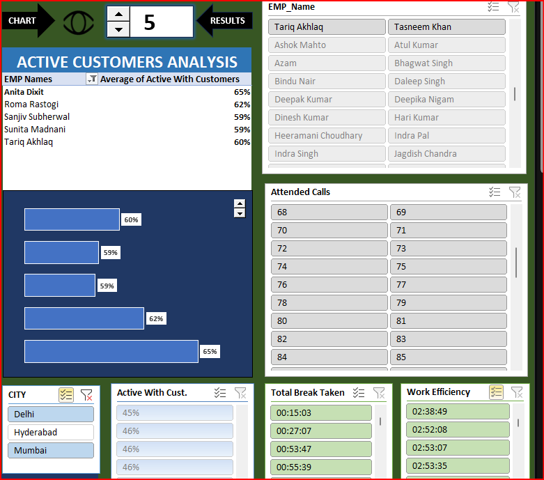
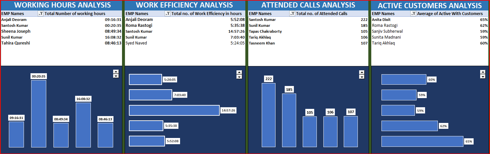

# 📊 Employee Performance Dashboard

<p align="center">
  
</p>

<h3 align="center">
Workforce Analytics | Productivity Insights | Customer Service Performance
</h3>

<p align="center">
An interactive Microsoft Excel dashboard built to analyze employee productivity, workforce efficiency, customer engagement, and operational performance using advanced Excel features including Pivot Tables, Pivot Charts, VBA Automation, Dynamic Slicers, and KPI Cards.
</p>

---

# 📌 Overview

Organizations generate massive volumes of employee performance data every day. However, transforming raw operational data into actionable business insights remains a challenge.

The **Employee Performance Dashboard** was developed to solve this problem by providing HR teams, operations managers, and business leaders with a centralized reporting solution that enables real-time monitoring of employee productivity and customer service performance.

The dashboard consolidates multiple performance metrics into a single executive view, making it easier to identify trends, compare employees, monitor operational efficiency, and support informed decision-making.

Unlike static reports, this dashboard offers fully interactive visualizations powered by slicers and automated Pivot Charts, allowing users to drill down into employee-level performance instantly.

---

# 🎯 Project Objective

The primary objective of this project is to:

* Monitor employee productivity
* Evaluate workforce efficiency
* Track customer service performance
* Measure operational KPIs
* Compare employee performance
* Support HR decision-making
* Improve business productivity
* Create executive-level performance reports

---

## 🎥 Project Demo

Watch the complete dashboard demonstration by clicking the image below.

[](https://drive.google.com/file/d/155vTGDmquZbU7_f6yaYVLCTO7b2dKj4H/view)

# 📊 Key Performance Indicators

The dashboard tracks the following business metrics:

| KPI                   | Description                                |
| --------------------- | ------------------------------------------ |
| ⏱ Working Hours       | Total working hours completed by employees |
| ⚡ Work Efficiency     | Productive working time of employees       |
| 📞 Attended Calls     | Number of customer calls handled           |
| 👨‍💼 Total Employees | Total employees under selected filters     |
| 👥 Active Customers   | Customers actively managed                 |
| 🏙 City               | Regional employee performance              |

---

# 📈 Dashboard Features

### ✔ Working Hours Analysis

Monitor employee working hours using interactive bar charts and ranking tables.

<p align="center">

</p>

Features

* Employee-wise comparison
* Dynamic ranking
* Highest & lowest performers
* Interactive filtering

---

### ✔ Work Efficiency Analysis

Measure productive working time to evaluate employee efficiency.

<p align="center">

</p>

Features

* Productive hours tracking
* Performance comparison
* Efficiency ranking
* Dynamic updates

---

### ✔ Attended Calls Analysis

Analyze customer interaction volume handled by employees.

<p align="center">

</p>

Features

* Call volume tracking
* Employee comparison
* Performance distribution
* Top performer identification

---

### ✔ Active Customers Analysis

Evaluate employee contribution toward active customer engagement.

<p align="center">

</p>

Features

* Customer engagement percentage
* Employee contribution
* Comparative visualization
* Performance benchmarking

---

### ✔ KPI Cards

Executive summary cards display the most important business metrics.

<p align="center">

</p>

Includes:

* Working Hours
* Work Efficiency
* Attended Calls
* Total Employees
* Active Customers
* Selected City

---

### ✔ Interactive Slicers

The dashboard includes dynamic slicers for instant report customization.

<p align="center">

</p>

Available Filters

* Employee Name
* City
* Attended Calls
* Active Customers
* Work Efficiency
* Break Time

---

### ✔ Dynamic Charts

All charts update automatically based on user selections.

<p align="center">

</p>

Visualization Types

* Bar Charts
* Horizontal Charts
* KPI Cards
* Ranking Tables
* Pivot Charts

---

# 💡 Dashboard Insights

Using this dashboard, management can quickly answer questions such as:

* Which employees worked the longest hours?
* Who achieved the highest work efficiency?
* Which employees attended the maximum customer calls?
* Which city has the highest workforce productivity?
* How many active customers are currently managed?
* Which employees require performance improvement?
* What operational trends exist across departments?

---

# 💼 Business Value

This dashboard can be used by:

* Human Resources
* Operations Teams
* Customer Support Managers
* Workforce Planning Teams
* Business Analysts
* Executive Leadership
* Performance Management Teams

---

# 🛠 Tools & Technologies

| Tool                   | Purpose                  |
| ---------------------- | ------------------------ |
| Microsoft Excel        | Dashboard Development    |
| Pivot Tables           | Data Aggregation         |
| Pivot Charts           | Data Visualization       |
| VBA                    | Dashboard Automation     |
| Slicers                | Interactive Filtering    |
| Conditional Formatting | Performance Highlighting |
| Excel Formulas         | KPI Calculations         |
| Data Validation        | User Input Control       |

---

# 📚 Excel Skills Demonstrated

* Advanced Excel
* Pivot Tables
* Pivot Charts
* Dashboard Design
* Data Cleaning
* Dynamic Charts
* Slicers
* VBA Automation
* KPI Development
* HR Analytics
* Data Visualization
* Business Reporting

---

# 🔄 Dashboard Workflow

```
Raw Employee Data
        │
        ▼
Data Cleaning
        │
        ▼
Pivot Tables
        │
        ▼
Pivot Charts
        │
        ▼
Dynamic Slicers
        │
        ▼
KPI Calculations
        │
        ▼
Interactive Dashboard
```

---

# 📂 Project Structure

```
Employee-Performance-Dashboard
│
├── Dashboard.xlsx
├── README.md
│
├── Images
│   ├── Dashboard_Home.png
│   ├── Working_Hours.png
│   ├── Work_Efficiency.png
│   ├── Attended_Calls.png
│   ├── Active_Customers.png
│   ├── KPI_Cards.png
│   ├── Slicers.png
│   └── Executive_View.png
│
└── Dataset
    └── Employee_Data.xlsx
```

---

# 🚀 Future Enhancements

* Department-wise analysis
* Monthly trend reporting
* Attendance analytics
* Employee attrition insights
* Salary analysis
* Performance forecasting
* Power Query integration
* Power BI version
* Automated PDF report generation
* Email report automation

---

